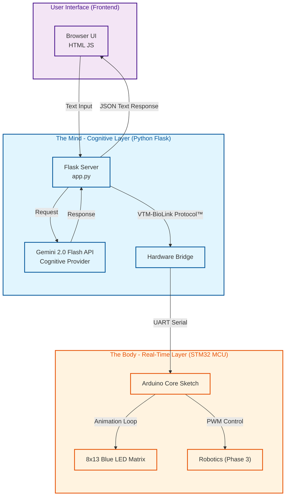

# System Architecture

© 2025 VTM Systems. All Rights Reserved.

## VTM Bio-Mimetic™ Architecture
The **VTM OS™** utilizes a proprietary **Bio-Mimetic Architecture** that decouples high-level reasoning from real-time physical control. While hardware-agnostic, this architecture is specifically optimized to maximize the hybrid capabilities of the **Arduino Uno Q**.

## Technical Abstract

### 1. The Cognitive Layer ("The Mind")
* **Runtime:** Python 3.11 environment running on the Qualcomm QRB2210 (Debian).
* **Orchestration:** A **Flask** server acts as the central nervous system, managing asynchronous I/O between the user interface, the AI cloud, and the hardware bridge.
* **Inference Pipeline:**
    * **Input:** Text input is captured in the browser and sent to the server as a JSON payload.
    * **Reasoning:** The input is processed by the AI, contextualized by a dynamic System Message (system_message.txt) that defines the bot's persona and operational constraints.
    * **Output:** Text responses are delivered directly to the browser UI. High-fidelity audio via the Google Cloud TTS Chirp Engine is a feature of the Professional/Industrial modules and is not included in this Community Edition.

### 2. The Real-Time Layer ("The Body")
* **Runtime:** C++ (Arduino Sketch) running on the dedicated STM32 microcontroller.
* **Responsibilities:** This layer handles timing-critical hardware tasks that require zero latency.
* **Synchronization:** The Linux MPU communicates with the MCU via a dedicated **Internal Bridge**.
    * *Mechanism:* The Python host communicates with the microcontroller using the **VTM-BioLink Protocol™** (a proprietary, high-speed telemetry standard).
    * *Example:* When the AI generates audio, the MPU sends the `set_mouth(1)` command via BioLink. The MCU instantly engages the animation loop on the **8x13 Blue LED matrix**. The duration is calculated by the MPU based on text length to ensure lip-sync approximations.

### 3. The Digital Twin (Development Workflow)
* The architecture allows for a "Digital Twin" workflow. The exact same Python code (`app.py`) runs on a macOS/Linux host for rapid prototyping—using the host's webcam and microphone—before being deployed to the embedded Uno Q target.
