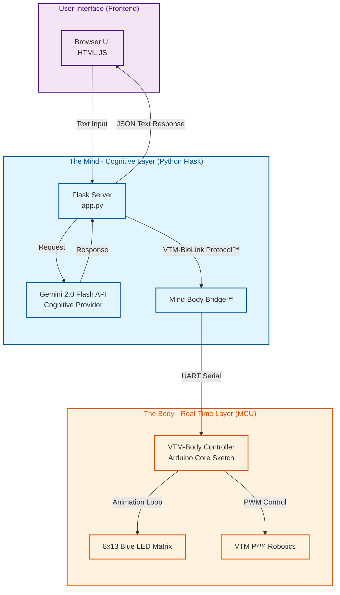

# System Architecture

**Copyright © 2026 VideotronicMaker™. All Rights Reserved.**

## VTM Bio-Mimetic™ Architecture
The **VTM OS™** utilizes a proprietary **Bio-Mimetic Architecture** that decouples high-level reasoning from real-time physical control. While hardware-agnostic, this architecture is specifically optimized to maximize the hybrid capabilities of the target hardware via the **Mind-Body Bridge™**.

```mermaid
%%{init: {'flowchart': {'rankSpacing': 120, 'nodeSpacing': 80}}}%%
flowchart TD
    %% Subgraph for the User Interface
    subgraph Face ["User Interface (Frontend)"]
        direction TB
        UI["Browser UI<br/>HTML JS"] 
    end

    %% Subgraph for the Cognitive Processor
    subgraph Mind ["The Mind - Cognitive Layer (Python Flask)"]
        direction TB
        Flask["Flask Server<br/>app.py"]
        
        UI -->|Text Input| Flask
        Flask -->|JSON Text Response| UI
        
        Flask -->|Request| LLM["Gemini 2.0 Flash API<br/>Cognitive Provider"]
        LLM -->|Response| Flask
        
        Flask -->|VTM-BioLink Protocol™| Bridge["Mind-Body Bridge™"]
    end

    %% Subgraph for the Real-Time Layer
    subgraph Body ["The Body - Real-Time Layer (MCU)"]
        direction TB
        Bridge -->|UART Serial| MCU["VTM-Body Controller<br/>Arduino Core Sketch"]
        MCU -->|Animation Loop| Matrix["8x13 Blue LED Matrix"]
        MCU -->|PWM Control| Servos["VTM P³™ Robotics"]
    end

    %% Styling
    classDef mind fill:#e1f5fe,stroke:#01579b,stroke-width:2px;
    classDef body fill:#fff3e0,stroke:#e65100,stroke-width:2px;
    classDef ui fill:#f3e5f5,stroke:#4a148c,stroke-width:2px;

    class Flask,LLM,Bridge mind;
    class MCU,Matrix,Servos body;
    class UI,Face ui;
    
    style Mind fill:#e1f5fe,stroke:#01579b,stroke-width:2px,color:#01579b
    style Body fill:#fff3e0,stroke:#e65100,stroke-width:2px,color:#e65100
    style Face fill:#f3e5f5,stroke:#4a148c,stroke-width:2px,color:#4a148c
```

## Technical Abstract

### 1. The Cognitive Layer ("The Mind")
* **Runtime:** Python 3.11 environment running on the host MPU (Qualcomm QRB2210/Linux).
* **Orchestration:** The **VTM Personality Core™** (running via Flask) acts as the central nervous system, managing asynchronous I/O between the user interface, the AI cloud, and the hardware bridge.
* **Inference Pipeline:**
    * **Input:** Text input is captured in the browser and sent to the server as a JSON payload.
    * **Reasoning:** The input is processed by the AI, contextualized by a dynamic System Message (`system_message.txt`) that defines the bot's persona and operational constraints.
    * **Output:** Text responses are delivered directly to the browser UI. Advanced multimodal features like Speech-to-Text and high-fidelity TTS are reserved for the **VTM OS™ Pro** modules.

### 2. The Real-Time Layer ("The Body")
* **Runtime:** C++ (Arduino Sketch) running on the dedicated hardware MCU.
* **Responsibilities:** This layer handles timing-critical hardware tasks that require zero latency, such as PWM servo positioning and LED matrix refreshes.
* **Synchronization:** The MPU communicates with the MCU via the **Mind-Body Bridge™**.
* **Mechanism:** The host communicates using the **VTM-BioLink Protocol™** (a proprietary, high-speed telemetry standard).
* **Example:** When intent is processed, the MPU sends a `set_mouth(1)` command via **VTM-BioLink™**. The MCU instantly engages the animation loop on the **8x13 Blue LED matrix**.

### 3. The Digital Twin (Development Workflow)
The architecture supports a "Digital Twin" workflow. The core logic (`app.py`) can be prototyped on a macOS/PC host—utilizing standard peripherals—before being deployed to the physical **VTM P³™** hardware target.
